<div align="center">

  <!-- Animated Particle Header Banner -->
  

  <br />

  <!-- Quick Links & Status Badges -->
  <a href="https://linkedin.com/in/mmd-rehan"></a>
  <a href="mailto:hi@mmd-rehan.com"></a>
  <a href="https://medium.com/@mrrehan"></a>
  <a href="https://fixcors.com"></a>
  <a href="https://noboxtv.com"></a>

  <br />

  <!-- Particle Divider -->
  

</div>

<br />

## 🪐 About Me

> **"Building reliable web and backend software across core industries."**

I am a **Software Engineer** based in **Dubai, UAE**, with **7+ years** of experience developing production software across **Healthcare**, **Aviation**, **Crypto Infrastructure**, and **Global Logistics**.

My experience includes building miner monitoring dashboards, developing booking flows for airlines at Amadeus, integrating **HL7 EMR standards**, and building interactive **WebGL frontend applications**.
 
  
---

## 🏆 Honors, Awards & Certifications

- 🏅 **Guinness World Records Title Holder** - Official participant in the *Kanz AI Hackathon*, certified as the largest online artificial intelligence lesson in history.
- 🥉 **2nd Runner-up, Hack2Hire 2.0** - HCLTech international programming competition (2025).
- 📜 **MongoDB Certified Professional** - MongoDB CRUD Operations & Aggregation Framework in Node.js (2025).
- 📜 **Angular Master Certification** - Deep dive in state management, NgRx Store & Effects (2025).
- 🏆 **Certificate of Excellence** - On-Spot Programming, Visio Spark (2015).

---

## 📊 Career Scorecard

<div align="center">

```
  ┌───────────────────────┬───────────────────────┬───────────────────────┐
  │      300,000+         │       Millions        │        7+ Years       │
  │   ASICs Monitored     │   Travelers Served    │  Engineering Mastery  │
  └───────────────────────┴───────────────────────┴───────────────────────┘
  ┌───────────────────────┬───────────────────────┬───────────────────────┐
  │       75+ Nodes       │     $10K - $20K       │     Guinness World    │
  │   K8s Cluster AWS     │  Saved Per Incident   │      Record Title     │
  └───────────────────────┴───────────────────────┴───────────────────────┘
```

</div>

<br />

<div align="center">
  

  ### 📬 Connect & Collaborate

  **Location:** Dubai, United Arab Emirates  
  **Email:** [hi@mmd-rehan.com](mailto:hi@mmd-rehan.com)  
  **LinkedIn:** [linkedin.com/in/mmd-rehan](https://linkedin.com/in/mmd-rehan)  
  **Website:** [Website](https://mmd-rehan)

  <br />

  <sub>Build with passion, particles, and precision by <strong>Muhammad Rehan</strong>.</sub>
</div>
